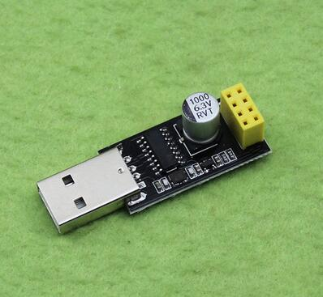
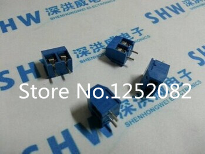
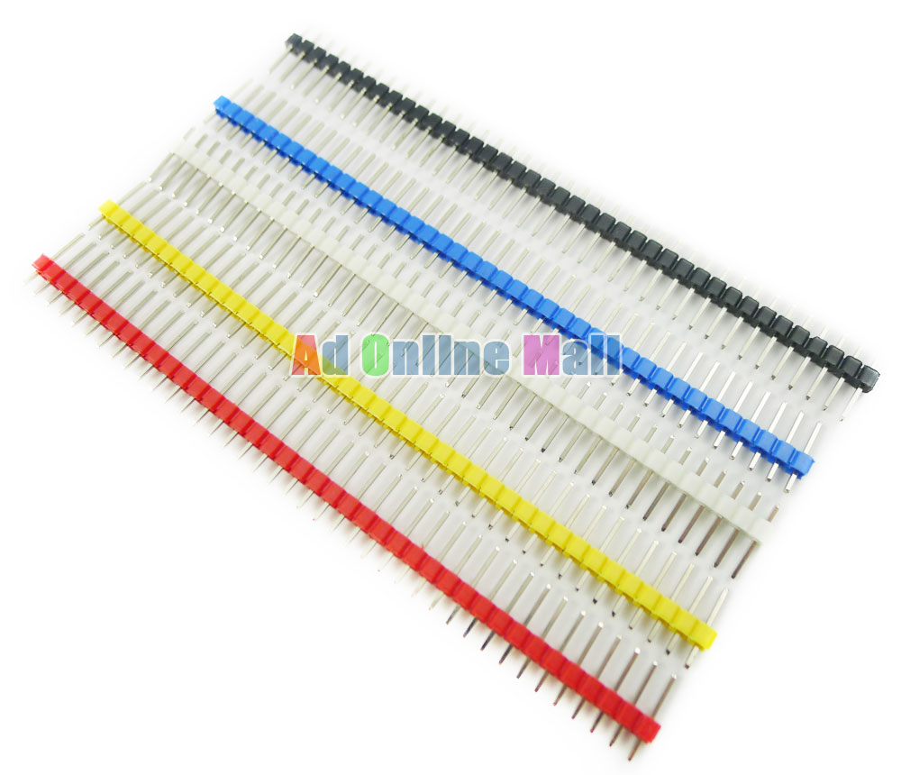
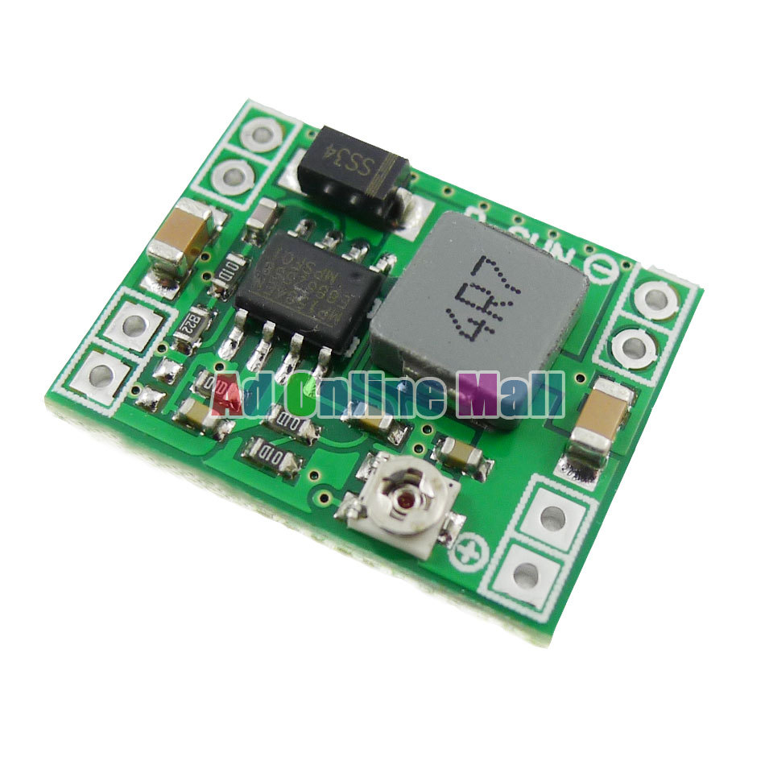
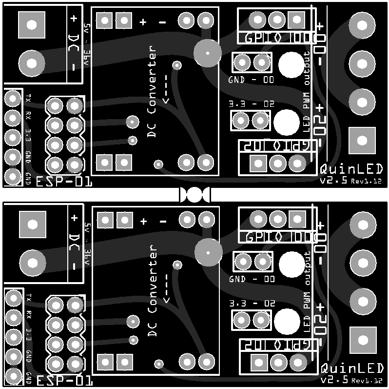
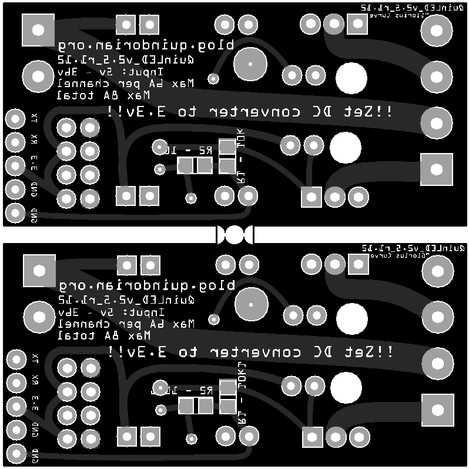

# Lista de materiales para montaje y experimentación con QuinLed

Materiales pedidos el 3/8/2016
Coste total: 35,02

* [Mosfet STP16NF06L](http://www.aliexpress.com/snapshot/7957305548.html?orderId=77331752640875)

10 unidades/11,5€
Se activan perfectamente desde las señales de 3.3v de los ESP8266 (probar con los IRF44Z)

* [Conector 2x4 para ESP8266](http://www.aliexpress.com/snapshot/7957305542.html?orderId=77331752610875)

10 unidades/0,69€

* [Adaptador de Corriente 12v 3A](http://www.aliexpress.com/snapshot/7957305540.html?orderId=77331752600875)

4,44€

* [5m de tira de leds blancos](http://www.aliexpress.com/snapshot/7957305552.html?orderId=77331752660875) 300 leds de tipo 5730

2,95€

* [USB serial para ESP8266](http://www.aliexpress.com/snapshot/7957305544.html?orderId=77331752620875)

1,44€

* [Terminales atornillables](http://www.aliexpress.com/snapshot/7957305550.html?orderId=77331752650875)

100 unidades/5,67€

* [Pines de colores](http://www.aliexpress.com/snapshot/7957289753.html?orderId=77331752700875)

1.1$

* [DC-DC Buck converter](http://www.aliexpress.com/snapshot/7957289755.html?orderId=77331752710875)

3,95$

* [PCBs](http://dirtypcbs.com/view.php?share=22911&accesskey=d71fb07b5c27833b79b3068bd48f9644)
PCB Top

PCB Bottom

14$ (12,88€)
