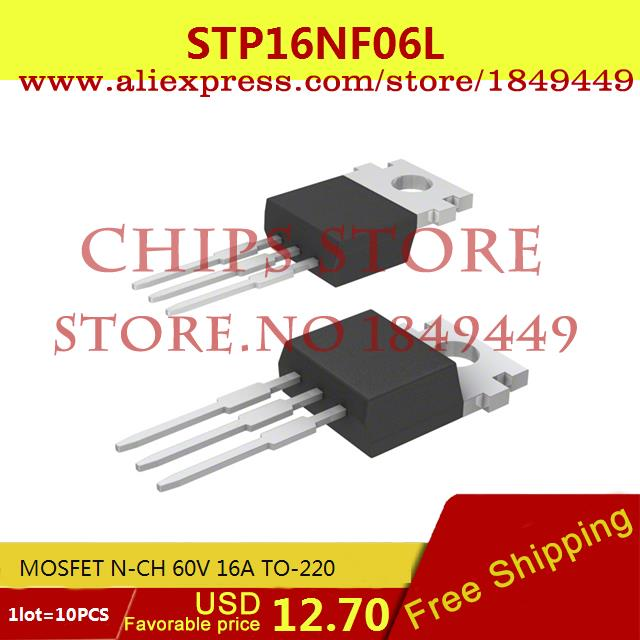
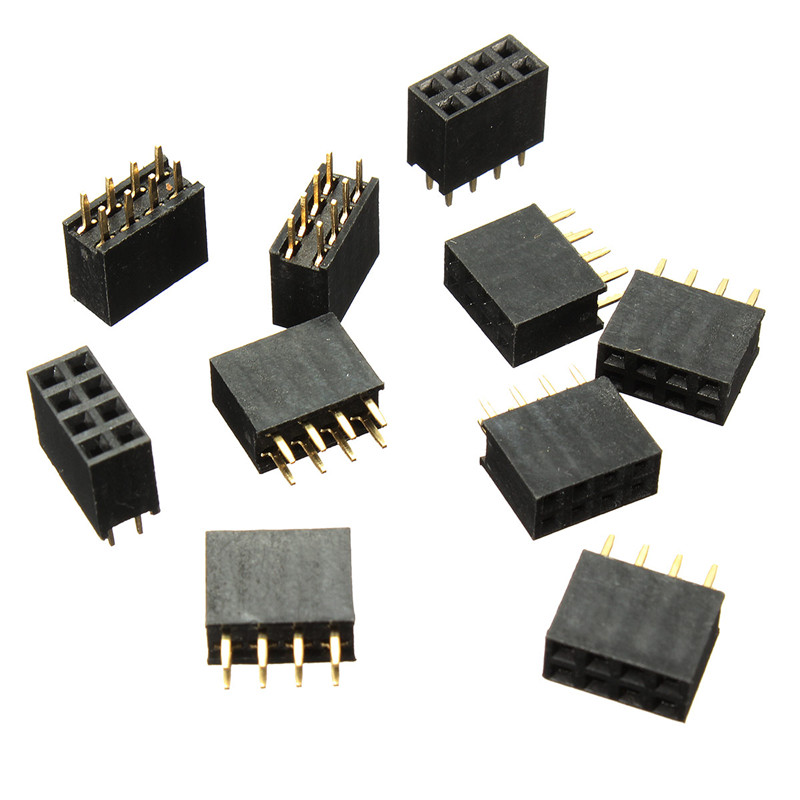
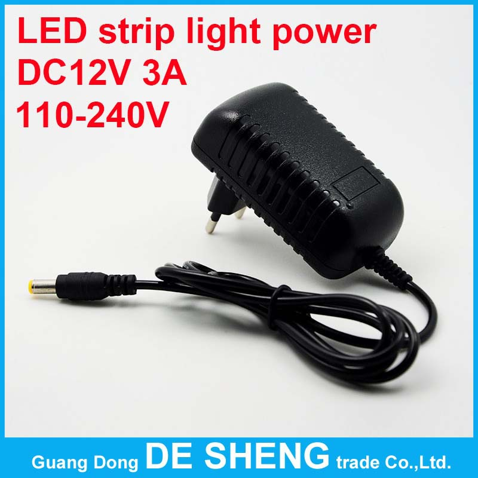
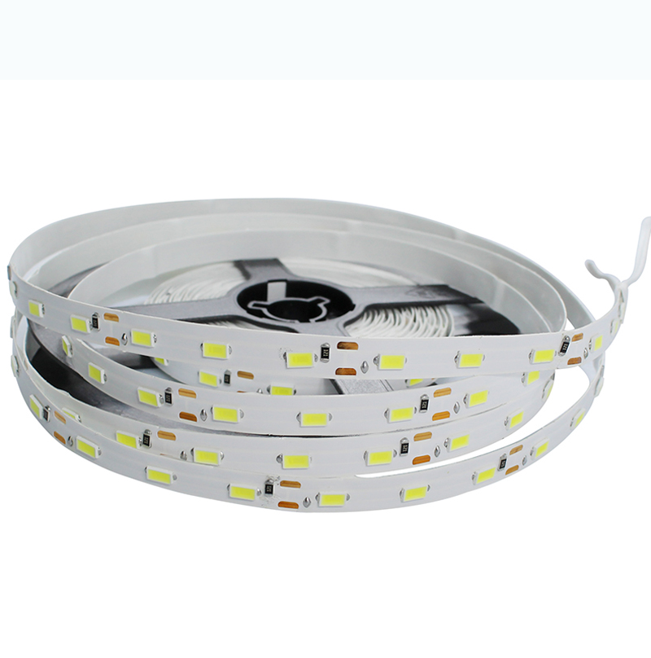

# Lista de materiales para montaje y experimentación con QuinLed

Materiales pedidos el 3/8/2016

* [Mosfet STP16NF06L](http://www.aliexpress.com/snapshot/7957305548.html?orderId=77331752640875)

10 unidades/11,5€
Se activan perfectamente desde las señales de 3.3v de los ESP8266 (probar con los IRF44Z)

* [Conector 2x4 para ESP8266](http://www.aliexpress.com/snapshot/7957305542.html?orderId=77331752610875)

10 unidades/0,69€

* [Adaptador de Corriente 12v 3A](http://www.aliexpress.com/snapshot/7957305540.html?orderId=77331752600875)

4,44€

* [5m de tira de leds blancos](http://www.aliexpress.com/snapshot/7957305552.html?orderId=77331752660875) 300 leds de tipo 5730

2,95€
