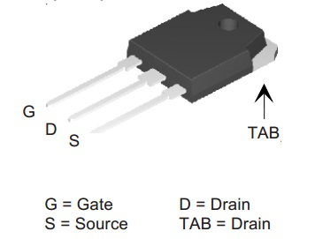

# Pines del Mosfet

[Fuente quidorian.org](http://blog.quindorian.org/2016/07/esp8266-lighting-revisit-and-history-of-quinled.html/mosfet_terminal1/)

# [Lista de componentes y Montaje de la v2](http://blog.quindorian.org/2015/04/esp8266-wifi-led-dimmer-part-8-of-x-version-2-of-the-pcb-design.html/)

# [Montaje, lista de componentes de la v1](http://blog.quindorian.org/2014/12/esp8266-wifi-led-dimmer-part-1-of-x_30.html/)

# [Vídeos sobre el tema](https://www.youtube.com/channel/UCv7UOhZ2XuPwm9SN5oJsCjA/videos)

# [Historia del desarrollo de QuinLed](https://www.youtube.com/watch?v=pn6T2ED-ZpA)

# [Sobre led y montaje de QuinLed](http://blog.quindorian.org/2016/08/esp8266-led-lighting-board-files-and-components-list.html/)

# [Diseño de la v2](http://blog.quindorian.org/2015/04/esp8266-wifi-led-dimmer-part-8-of-x-version-2-of-the-pcb-design.html/)

# [Leds 5730](http://nergiza.com/led-smd-5730-es-mas-eficiente/)
